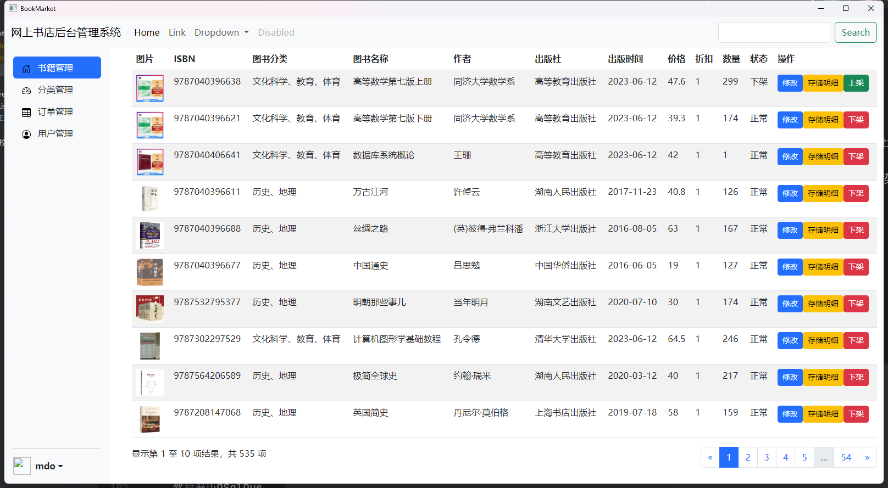

# 网上书店（BookMark）

## 项目说明

这是一个Qt项目，实现网上书店管理员的基本功能，比如：

* 管理员登录
* 图书商品的管理
* 订单管理
* 用户管理
* ...（没想好，后面再改）

## 使用的框架

* Qt
* Vue
* BootStrap
* ...（没想好，后面再改）

## 项目进展

### 2023/7/28

开始是准备使用QWidget那一套方式进行界面搭建，但发现界面样式不好看，然后发现QSS，但又由于QSS编写难度较大，最后放弃。  
然后准备尝试使用QWebEngine，突然发现可以使用QWebChannel与Javascript做交互，并且能使用许多成熟的前端框架（Vue、BootStrap等）,所以采用此方案。

### 2023/8/5
#### 先总结一下：反射太爽了
#### 目前界面效果如下

1. Book实体类（使用了Qt反射，提高编写效率）
* 代码如下：
~~~C++
class Book : public QObject {
Q_OBJECT
    Q_PROPERTY(int id READ getId WRITE setId)
    Q_PROPERTY(QString bid READ getBid WRITE setBid)
    ...
private:
    //属性
public:
    Q_INVOKABLE explicit Book(QObject *parent = nullptr) : QObject(parent) {}
    //get、set
};
~~~
* 创建好实体构造函数、属性、get、set方法，重载流操作符
* 让实体类继承QObject，并添加Q_Object宏
* 使用Q_PROPERTY宏注册属性、get、set方法，使用Q_INVOKABLE宏注册需要反射调用的函数（比如构造函数）

2. DataBaseUtils工具类（使用模板函数、Qt反射，处理Sql查询）
* 代码如下：
~~~C++
class DataBaseUtils {
public:
    template<class ...Args>
    static int addData(QString sql, Args...var) {return modify(sql, var...);}

    template<class ...Args>
    static int updateData(QString sql, Args...var) {return modify(sql, var...);}

    template<class ...Args>
    static int deleteData(QString sql, Args...var) {return modify(sql, var...);}

    template<class T, class ...Args>
    static QVector<T *> search(QString sql, Args...var) {
        QVector<QVariant> args{var...};//获取不定长参数
        QVector<T *> list;
        QSqlQuery *query = DataBaseBean::getConnection();
        query->prepare(sql);
        for (int i = 0; i < args.size(); i++) {
            query->bindValue(i, args[i]);//与sql语句绑定
        }
        query->exec();
        QStringList headList;//获取sql查询表头
        QSqlRecord sqlRecord(query->record());
        for (int i = 0; i < sqlRecord.count(); i++) {
            headList << sqlRecord.fieldName(i);
        }
        //qDebug() << headList;
        while (query->next()) {
            T *t = (T *) T::staticMetaObject.newInstance();//把值填充到对象中
            for (int i = 0; i < headList.size(); i++) {
                QString fieldName = headList[i].toLower();
                t->setProperty(fieldName.toStdString().data(), query->value(i));
            }
            list.push_back(t);
        }
        return list;
    }

    template<class ...Args>
    static QVariant searchCount(QString sql, Args...var) {...}

private:
    template<class ...Args>
    static int modify(QString sql, Args...var) {...}
};
~~~
* 这里以DataBaseUtils::search()为例。该函数的作用是传入SELECT的查询语句，返回对应的查询结果。
  首先使用QVector<QVariant> args{var...}获取不定长参数，使用DataBaseBean::getConnection()获取QSqlQuery对象（类似于Java的Connection、ResultSet），
  调用QSqlQuery对象的bindValue()替换掉SQL语句的占位符，最后调用exec()执行SQL语句。  
  执行SQL后，调用record()获取QSqlRecord对象（里面保存了SQL的查询信息），根据该对象可以获得SQL执行完后的列名。
  然后遍历QSqlQuery对象，使用T::staticMetaObject获取泛型的元数据对象，并调用newInstance()（使用该方法的前提是必须使用Q_INVOKABLE宏注册构造函数）函数创建泛型对象，
  然后循环遍历SQL查询列名使用泛型对象的setProperty()填充属性（使用该方法的前提是必须使用Q_PROPERTY宏注册属性、get、set），最后把该对象添加到QVector当中返回。

3. JSON工具类（使用模板函数、Qt反射，使C++对象转换为JSON字符串）
* 代码如下：
~~~C++
class JSON {
public:
    template<class T>
    static QJsonArray toJSONArray(QVector<T *> list) {
        QJsonArray jsonArray;
        for (int i = 0; i < list.size(); i++) {
            jsonArray.append(toJSONObject(list[i]));
        }
        return jsonArray;
    }

    template<class T>
    static QJsonObject toJSONObject(T *object) {
        QJsonObject qJsonObject;
        QMetaObject metaObject = T::staticMetaObject;
        for (int i = metaObject.propertyOffset(); i < metaObject.propertyCount(); i++) {
            QMetaProperty propertyName = metaObject.property(i);//获取属性名称
            QVariant propertyValue = object->property(propertyName.name());//获取属性值
            if (propertyName.typeId() == QMetaType::Type::QDateTime) {
                //QDateTime转换为QString
                qJsonObject[propertyName.name()] = propertyValue.toString();
            } else if (propertyName.typeId() == QMetaType::Type::QByteArray) {
                //QByteArray进行Base64加密，转QString
                qJsonObject[propertyName.name()] = QString::fromUtf8(propertyValue.toByteArray().toBase64());
            } else {
                qJsonObject[propertyName.name()] = propertyValue.toJsonValue();
            }
        }
        return qJsonObject;
    }
};
~~~
* 和上个类一样，使用到了元数据，这里是使用元数据把泛型对象的属性名称和属性值读取出来（metaObject.property(i)和object->property(propertyName.name())），存放到QJsonObject当中。
  如果是数组则循环调用toJSONObject()，把所有QJsonObject对象存放到QJsonArray
* 后面有可能添加一个JSON转C++对象的方法

4. DataBaseBean工具类（使用QtSQL，创建数据库连接）
* 很简单，看代码就能看懂

5. BookDao（书籍数据访问层）
* 定义和Java一样，照着JavaWeb那套写就完事了

5. BookService（书籍服务层）
* 这里可以照着JavaWeb那套来写逻辑操作，然后分出一个控制层（BookController）使用QWebChannel与前端JavaScript交互。我这里偷了个懒，两层合并了。
* Web端需要调用Qt槽函数来传递数据，必须声明为public slots，否则web找不到。在Web使用函数名调用，就可以Web-》Qt发送数据（如果槽函数有返回值，在JS使用回调函数接收）
* Qt发送给Web的信号必须声明为signals，然后在Web注册槽函数，就可以Qt-》Web发送数据
* 必须继承QObject，并加上Q_Object宏

6. 调用webChannel->registerObject("bookService",new BookService());将自定义对象注册到QWebChannel中

### 2023/8/18
* 在传统Web项目当中，我们经常使用比如jQuery或者Vue的axios来与后端异步通信，语法很简便，代码如下：
~~~JavaScript
$.ajax({url: '', method: '', data: {}}).then(function (response) {
    //处理结果
});

proxy.$axios.post(url, 发送参数, ...}).then(response => {
    //处理结果
})
~~~
* 当我们使用QWebChannel后，也可与Qt C++代码交互，代码如下：
~~~JavaScript
new QWebChannel(qt.webChannelTransport, function (channel) {
    let cppObj = channel.objects.cppObj;
    cppObj.你要使用的函数名(对应函数参数,function (response){
        //处理结果
    });
});
~~~
* 也比较简便，但有个问题，当一个界面需要和多个QWebChannel注册对象交互时，就需要这样写了
~~~JavaScript
new QWebChannel(qt.webChannelTransport, function (channel) {
    let cppObj1 = channel.objects.cppObj1;
    let cppObj2 = channel.objects.cppObj2;
    let cppObj3 = channel.objects.cppObj3;
    //...
    cppObj1.你要使用的函数名(对应函数参数,function (response){
        //处理结果
    });
    cppObj2.你要使用的函数名(对应函数参数,function (response){
        //处理结果
    });
    cppObj3.你要使用的函数名(对应函数参数,function (response){
        //处理结果
    });
    //...
});
~~~
* 不如传统Web的jQuery和axios简洁，并且需要注册多个QWebChannel对象，麻烦。
  所以在这里使用”代理模式“（不算是严格的代理模式），借助Qt反射和代理模式的思想，简化该步骤，使其变为如下形式
~~~JavaScript
new QWebChannel(qt.webChannelTransport, function (channel) {
    let proxyService = channel.objects.proxyService;
    proxyService.executeService({class: "对应执行函数的类名", method: "执行函数的函数名",函数参数...},function (response){
        //处理结果
    });
});
~~~
* ProxyService代码如下：
~~~C++
//定义
class ProxyService : public QObject {
Q_OBJECT
public:
    explicit ProxyService(QObject *parent = nullptr);
public slots:
    QVariant executeService(QJsonObject param);
};

//实现
ProxyService::ProxyService(QObject *parent) : QObject(parent) {}

QVariant ProxyService::executeService(QJsonObject param) {
    QString className = param["class"].toString();//执行的类
    QString methodName = param["method"].toString();//执行的函数名
    QMetaType metaType = QMetaType::fromName(QByteArrayView(className.toUtf8()));//获取代理类的元类型
    QMetaObject metaObject = *metaType.metaObject();//获取代理类的元数据
    QObject *object = metaObject.newInstance();//创建对象
    QVariant result;
    QMetaObject::invokeMethod(object, methodName.toUtf8().constData(),
                              Q_RETURN_ARG(QVariant, result),
                              Q_ARG(QJsonObject, param));//执行函数
    delete object;
    return result;
}
~~~
* 这样就可以借助Qt反射帮我们执行函数了，但需要对被反射对象进行注册，修改BookService如下（其实就是加了个Q_INVOKABLE，和注册类型）
~~~C++
class BookService: public QObject{
    Q_OBJECT
public:
    Q_INVOKABLE explicit BookService(QObject *parent = nullptr);
private:
    BookDao bookDao;
public slots:
    Q_INVOKABLE QJsonObject getBookList(QString bname, int page, int count);//老方法，需要声明为槽函数
    
public:
    Q_INVOKABLE QVariant getBookList(QJsonObject param);//新方法
};
Q_DECLARE_METATYPE(BookService)//注册类型

qRegisterMetaType<BookService>("BookService");//主函数或其他位置加入，注册类型
~~~
* 这样就只需要注册一个QWebChannel对象，就能完成所有操作了
~~~C++
webChannel->registerObject("proxyService",new ProxyService());//将自定义对象注册到QWebChannel中，注册一次即可
~~~